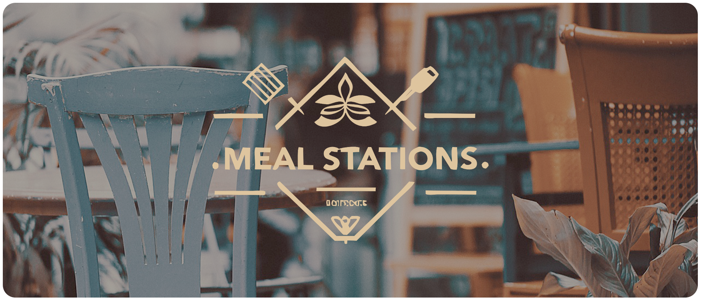

<br>

<p align="center">
    
</p>

<p align="center">
    
         
    
</p>

<br>

### **<h3 align="center">Tópicos 📋</h3>**

##

<p>

  - [Sobre 📖](#sobre-)
  - [Layout 🎨](#layout-)
  - [Como Usar 🤔](#como-usar-)

</p>

<br>

### **<h3 align="center">Sobre 📖</h3>**

##
   

O projeto **Meal Station** foi desenvolvido para facilitar o ambiente de estação de refeição. Assim como no shopping ou lugares que tem centro de refeições que faz o projetos ser inéditos e inspirador. 
>O **Meal Station** se trata de um app mobile feito em Flutter & Dart, contendo recursos como o uso de Animações e Estilizações Personalizadas, entre vários outros pontos, como o uso do SharedPreferences.


<br>

### **<h3 align="center">Layout 📋</h3>**

##

   <p align="center">
      
   </p>

   <p align="center">
      O Layout foi desenvolvido por <a href="https://www.instagram.com/kyuorhan">Jhonny Kyuorhan</a>, e você pode acessá-lo no Figma:
   
   - <a href="https://www.figma.com/file/kLK7FYnWKMoN68sQXcSniu/PayFlow">Mobile</a> 📱
   </p>

<br>

### **<h3 align="center">Como Usar 🤔</h3>**

##

   ```
   - Clone esse repositório:
   $ git clone https://github.com/Kyuorhan/meals

   - Entre no diretório:
   $ cd meals

   - Instale as dependências:
   $ flutter pub get

   - Inicie o app: 
   $ flutter run
   ```
 
##

   >Esse projeto foi desenvolvido com ❤️, sempre estarei buscando e trazendo novos desafios.<br>
   **[Participe a vontade de troca ideias no meu Github! 👋](https://github.com/Kyuorhan)**.
 
<br>

 <div align="center" > 
  <a href="https://www.linkedin.com/in/jhonny-kyuorhan/" target="_blank"> </a> 
  <a href = "mailto:jkdevprogrammer@gmail.com"></a>
  <a href="https://www.instagram.com/kyuorhan" target="_blank"> </a>
  <a href="https://steamcommunity.com/id/Kyuorhan/" target="_blank"> </a>   
  <a href="https://www.twitch.tv/kyuorhan" target="_blank"> </a> 
</div>    
